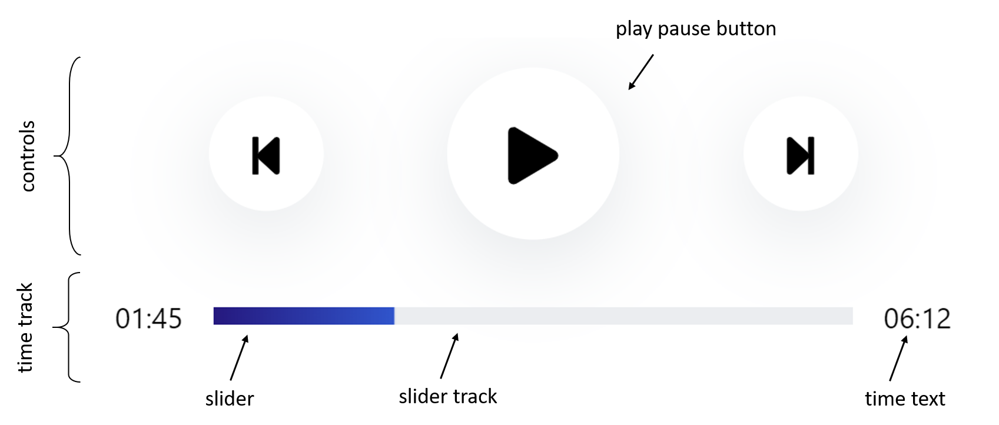
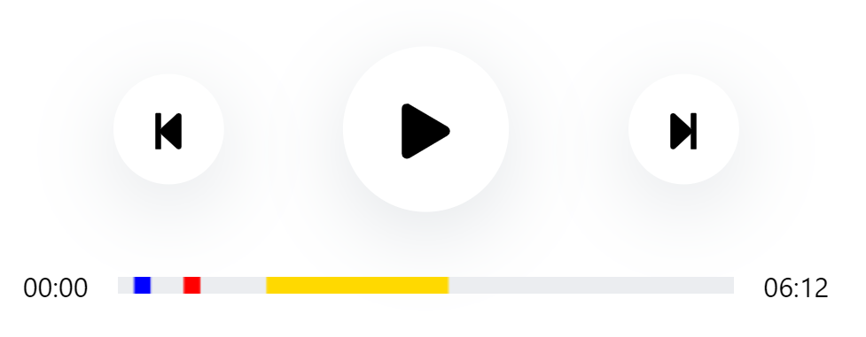
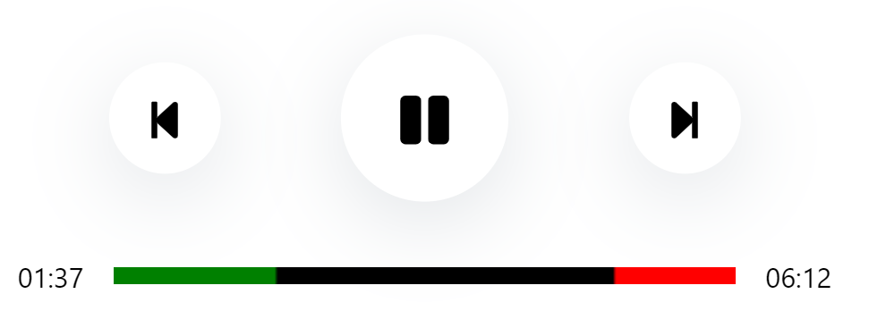
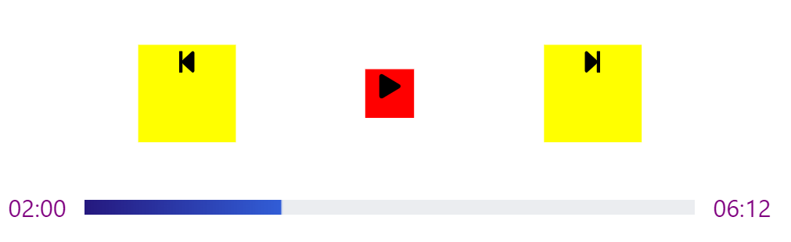

# React Audio Element

Styling the embedded audio element is limited. According to MDN,

> You can style the default controls with properties that affect the block as a single unit, so for example you can give it a border and border-radius, padding, margin, etc. You can't however style the individual components inside the audio player (e.g. change the button size or icons, change the font, etc.), and the controls are different across the different browsers.

This component presents a beautifully styled audio element, made using canvas. There is a lot of flexibility that comes with this element, which allows you to style it to your needs.

## Basic Usage

```
import React, { Component} from 'react';
import AudioPlayer from 'react-audio-element';

export default class Example extends Component {
  render() {
        return (
            <AudioPlayer
                src="https://www.soundhelix.com/examples/mp3/SoundHelix-Song-1.mp3"
            />
        );
     }
}
```

## Terminology


## Props

| Name           | Type    | Default             | Description                                                                                                                                                                                      |
| -------------- | ------- | ------------------- | ------------------------------------------------------------------------------------------------------------------------------------------------------------------------------------------------ |
| src            | string  | ""                  | the source for the audio element                                                                                                                                                                 |
| className      | string  | react-audio-element | The className for this component, for your styling purposes                                                                                                                                      |
| overrideStyles | boolean | false               | if you would like to override all styling provided, set this to true                                                                                                                             |
| classNames     | object  | null                | provide the classNames for the different parts of the element you want to style yourself. You have to set overrideStyles to true if you want all your styling to apply.                          |
| colors         | object  | null                | if you would like to change the colors of the slider, you can't use css because it is drawn on a canvas element. Instead, pass the color strings in an object here. Gradients are not supported. |
| sliderTop      | boolean | false               | if you would like your slider to appear on top of the controls instead of below, set this to true                                                                                                |
| showHours      | boolean | false               | if you would like the time to show 00:00:00 instead of 00:00, set this to true                                                                                                                   |
| skipSeconds    | float   | 10                  | set the number of seconds you would like the forward and backward buttons to skip                                                                                                                |
| timestamps    | array   | null                  | If you would like there to be markings on your slider track, pass in an array of the timestamps you would like them to appear at                                       |

### Timestamps

Example Usage:
```
<AudioPlayer
    timestamps={
        [
            {startTime: 10, endTime: 20, color: "blue"}, 
            {startTime: 40, endTime: 50, color: "red"}, 
            {startTime: 90, endTime: 200}
        ]
    }
    src="https://www.soundhelix.com/examples/mp3/SoundHelix-Song-1.mp3"
/>
```

Outcome:


It is optional to provide "color" for each timestamp. If not color is provided, either the default or the color provided by the user in the "colors" prop will be used. 
### Changing Colors
Example Usage:
```
<AudioPlayer
    src="https://www.soundhelix.com/examples/mp3/SoundHelix-Song-1.mp3"
    timestamps={[{startTime: 300, endTime: 400}]}
    colors = {{sliderTrack : "black", slider : "green", timestamps: "red"}}
/>
```
Outcome:


The colors props is meant to change the colors of anything pertaining to the slider track area. 

### Overriding Styles
Example Usage:
```
<AudioPlayer
    src="https://www.soundhelix.com/examples/mp3/SoundHelix-Song-1.mp3"
    overrideStyles = {true}
    classNames = {
          { controlButton : "custom-control",
            playPause: "custom-play-pause" ,
            timeText: "custom-time-text",
            sliderTrack : "custom-slider-track"
          }
    }
/>
```
in css:
```
.custom-control{
  background-color: yellow;
  width: 4rem;
  height: 4rem;
}

.custom-play-pause{
  background-color: red;
  width: 2rem;
  height: 2rem;
}

.custom-time-text{
  color: purple;
}

.custom-slider-track{
  width: 400px;
  height: 10px;
}
```

Outcome:



You have to set overrideStyles to true if you want more perdictable behavior.


## Limitations
The canvas element must be fed absolute widths and heights. Therefore, if you choose to style the slider track by yourself, please set widths and heights in pixels, rem or em, and not percentages.

## Works in Progress

- Ref Forwarding
- Drag to seek
